<!--
**Jiab77/jiab77** is a ✨ _special_ ✨ repository because its `README.md` (this file) appears on your GitHub profile.

Here are some ideas to get you started:

- 🔭 I’m currently working on ...
- 🌱 I’m currently learning ...
- 👯 I’m looking to collaborate on ...
- 🤔 I’m looking for help with ...
- 💬 Ask me about ...
- 📫 How to reach me: ...
- 😄 Pronouns: ...
- ⚡ Fun fact: ...
-->

<h2 align="center">Hi there 👋, I'm Doctor Who</h2>
<h3 align="center">Just a ghost on the Internet.</h3>
 
<h3 align="left">What am I doing over here?</h3>

- 🔭 I’m currently working on [Athena](https://github.com/Jiab77/athena)
- 🌱 I’m willing to learn __Golang__ and __Rust__
- 👯 I’m happy to collaborate on __security / hacking__ related projects
- 📫 You can reach me via __Telegram__ if you can find me 😜

<!--
As nobody decided to donate for my projects,
no reasons to keep them visible.

<h3 align="left">Want to support me or my projects?</h3>

Feel free to donate anything you want to the following addresses:

- Bitcoin (BTC): `bc1qdn8stqmaf0zackrqxnrv57vj5f8ewyf34gxgcj`
- Ethereum (ETH): `0x54e7328C44deEE18dD54d8AdC6eDdD762D9e8302`
- Dash: `Xvn5voYZRwHuGzJCbAeCo5e9Zi5A4ECEJP`
- Zcash (ZEC): `zs1e2zh2pudrrghqjhuy3cf3sypt4dm7e47cw23zv4zhxn5t7pjsd9p8qulhsf58n3gvxgy703zwd7`
- XMR: `49UFMjWpZLcXHL4PbnFcvqXXQPqd5jqveXSAXXmeWJzABNbyxQMTeMwh9Q9Z2FhPYycTgzi9SCYMxHPcdWZq1RJm9Hehq6q`
-->

<h3 align="left">Some stats about me?</h3>

  <!--
  
  -->
  
  <!--
  
  -->
  

